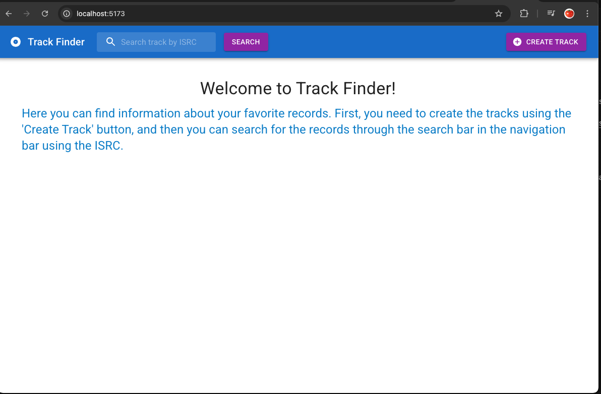
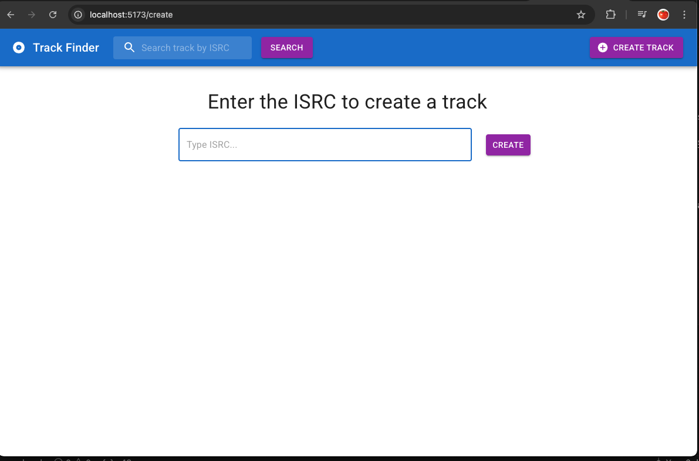
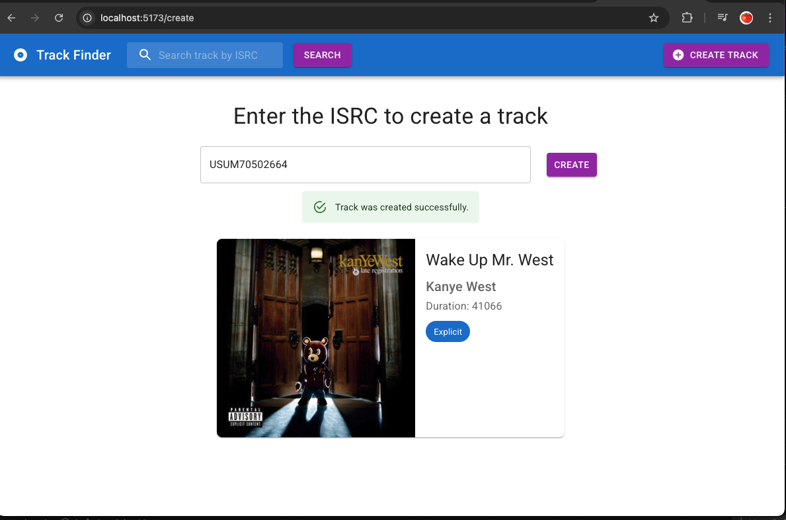
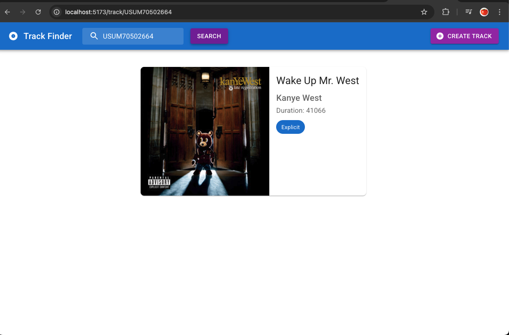
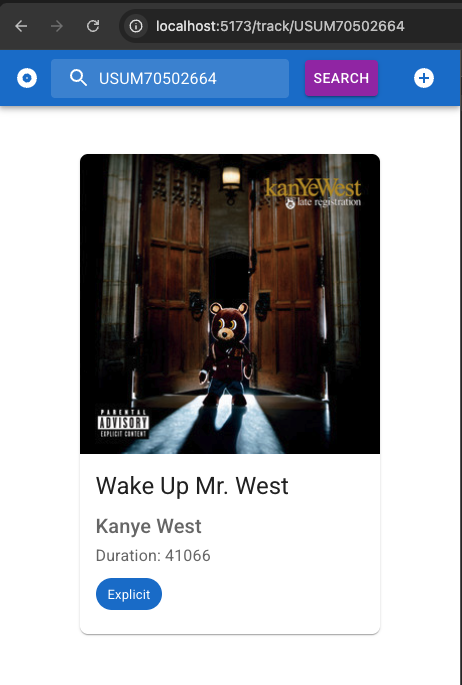

# ISRC Track Manager

**ISRC Track Manager** is a platform that allows you to create and query songs in a local database using an ISRC code. The system connects to the Spotify API to retrieve metadata based on the provided ISRC, and stores it locally.

## Features

- **Create new track**: Enter an ISRC code, and the system will fetch the corresponding track metadata from Spotify and store it in the database.
- **Search existing tracks**: Look up songs by ISRC to check if they’re already in the database and view their details.
- **User-friendly interface**: A top navigation bar with a search input and a “Create Track” button for quick access.

## Technologies Used

- Material UI
- Redux Toolkit
- React
- React DOM
- React Redux
- React Router

The project was created with **Vite**.

## Scripts

```bash
npm install

npm run dev

npm run build

```

## Main UI interfaces

### Main Screen



### Create Track




### Track Details



### Mobile


